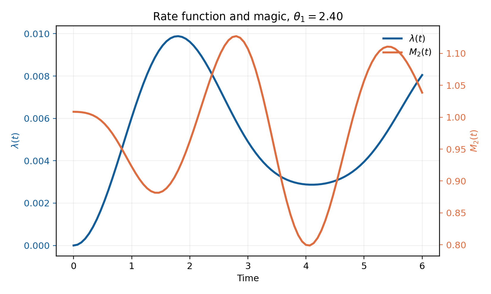
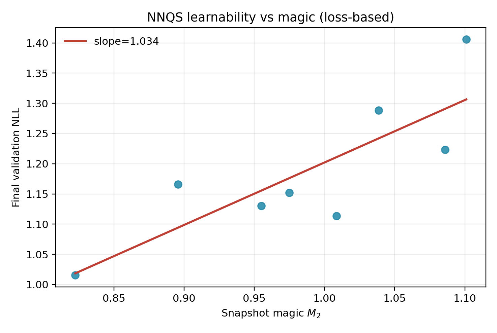

# Theta-Quench Schwinger Lab


A mini research toolkit for **real-time dynamics in a lattice gauge model**.
This project tests the hypothesis that stronger Schwinger-model \(\theta\)-quenches increase both transition diagnostics and stabilizer magic, and that **higher-magic snapshots are harder for NNQS training**.

## Key Results (30-second view)

| Transition + Magic Hook | Learnability Hook |
|---|---|
|  |  |
| Loschmidt-rate structure co-evolves with stabilizer Rényi magic \(M_2(t)\). | Higher snapshot magic correlates with worse NNQS validation loss. |

Live project page (GitHub Pages target): `docs/index.html`

## Reproduce Paper Figures

```bash
python3 -m tqm.run --config configs/default.yaml --all
make release-assets
```

This rebuilds figures, dashboard assets, short PDF report, and cached artifacts.

## Model Details

Hamiltonian (open boundary, Gauss-law eliminated spin form):

\[
H(\theta) = H_{\pm} + H_{ZZ} + H_Z + \mathrm{const}
\]

with nearest-neighbor kinetic term and nonlocal Coulomb-like \(ZZ\) terms from electric-field elimination.

- Primary system size (default): `N = 6` qubits (exact, laptop-safe)
- Optional heavier config: `N = 8` (`configs/research_heavy.yaml`)
- Dynamics: exact ground state + real-time unitary evolution (dense/Krylov)
- Diagnostics: Loschmidt rate, staggered mass proxy, entanglement entropy, stabilizer Rényi magic, NNQS fit metrics

## Compute Cost

This repository is intentionally **small-N exact**.
- Why: deterministic correctness checks and full-state diagnostics (including exhaustive Pauli-based magic) are feasible only at small Hilbert space.
- Typical runtime (default config on laptop): minutes, not hours.
- `research_heavy.yaml` is slower and intended for deeper sweeps, still in exact small-N regime.

## Determinism and Validation

- Deterministic configs: `configs/default.yaml`, `configs/no_nnqs.yaml`, `configs/research_heavy.yaml`
- Manual independent audit:

```bash
make audit
```

- NNQS seed robustness:

```bash
make seed-sweep
```

- Validation output: `outputs/validation.json`
- Cached baseline artifacts for reviewers: `cached_runs/`

## Environment (Pinned)

- Full pipeline (with NNQS): `requirements.txt`
- Physics-only (no torch): `requirements-no-nnqs.txt`

Install example:

```bash
python3 -m venv .venv
source .venv/bin/activate
pip install -r requirements.txt
pip install -e .
```

## Report

- Short reviewer PDF: `report/short_report.pdf`
- TeX source report: `report/main.tex`

## Roadmap

1. Push to larger `N` via symmetry sectors and block-sparse methods.
2. Add approximate/Monte-Carlo magic estimators beyond exhaustive Pauli sweeps.
3. Extend NNQS architecture and basis coverage (phase-aware learning).
4. Add Trotterized circuit pathway for hardware-oriented experiments.
