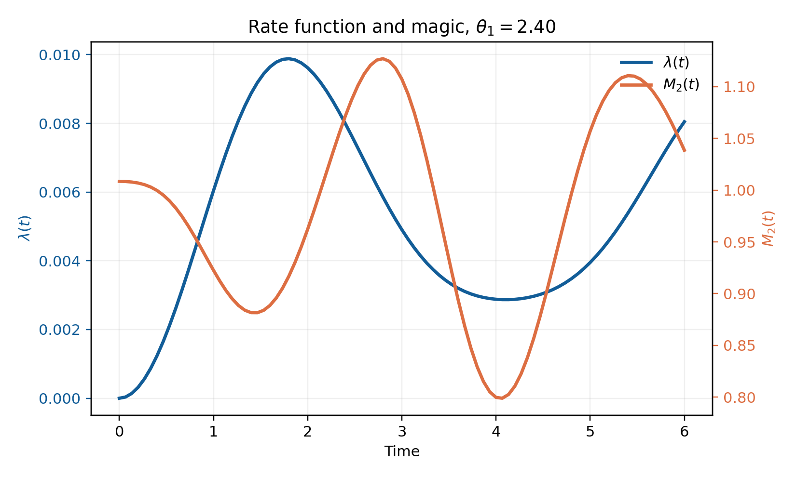
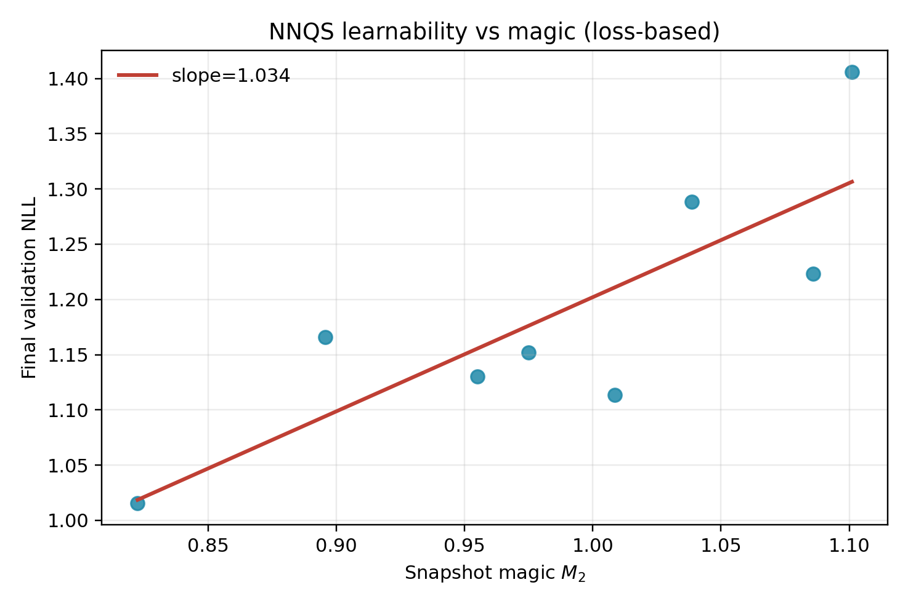

# Theta-Quench Schwinger Lab


A reproducible mini-research toolkit for lattice Schwinger-model \(\theta\)-quench dynamics, stabilizer magic, and NNQS learnability.

## Project provenance

This repository was motivated directly by the Institute for Nuclear Theory (INT) INTURN 26-3 project theme, "Quantum Magic in Topological Vacuum Dynamics" on the [INTURN open projects page](https://www.int.washington.edu/index.php/inturn).

That means the motivating research direction did not originate independently with this repo. What is original here is the implementation and exploratory evidence package: the code, exact-dynamics pipeline, NNQS fitting study, replication runs, and the scoped empirical claims reported below are my own independent undergraduate work built in response to that project theme.

Core scoped hypothesis:
- In baseline small-\(N\) exact simulations, higher stabilizer magic tends to coincide with harder NNQS fitting (higher validation NLL).
- Correlation-sign behavior is **not universal** in current data, but an entropy-controlled slope law is supported in the Stage 2 corridor.

Hyak replication update:
- checkpoint-GPU reruns strengthened the baseline cross-architecture evidence: GRU, MADE, and RBM all reproduced a positive `magic -> validation NLL` trend in the main corridor.
- the current exact `N=10` rerun remained noisy at the raw-correlation level, but the entropy-controlled endpoint stayed positive across GRU / RBM / independent baselines.
- alternate regimes sharpened the claim boundary: heavy-mass is mixed, strong-coupling is unsupported.

## Key Results (30-second view)

| Transition + Magic Hook | Learnability Hook |
|---|---|
|  |  |
| Loschmidt-rate structure co-evolves with stabilizer Renyi magic \(M_2(t)\). | In baseline small-\(N\) settings, higher snapshot magic correlates with worse NNQS validation loss. |

Live page: [GitHub Pages](https://divijchawla.github.io/theta-quench-schwinger-lab/)

## Hyak Replication Snapshot

Completed checkpoint-GPU replications (synced back under `outputs_hyak_runs/`) tightened the main empirical claim:

| Run | Main endpoint | Result |
|---|---|---|
| GRU baseline full-\(\theta\), `N=6` | pooled `magic -> val NLL` | `r=0.857`, `q=1.79e-12`, supported |
| GRU baseline full-\(\theta\), `N=6` | pooled `magic -> val NLL | entropy` | `r=0.913`, `q=2.01e-10`, supported |
| MADE, `N=6,8` | pooled `magic -> val NLL | entropy` | `r=0.745`, `q=3.10e-06`, supported |
| RBM, `N=6,8` | pooled `magic -> val NLL | entropy` | `r=0.896`, `q=2.39e-18`, supported |
| exact `N=10` | raw `magic -> val NLL` | unsupported in current rerun |
| exact `N=10` | `magic -> val NLL | entropy` | positive across GRU / RBM / independent (`r≈0.50–0.58`) |
| heavy-mass alternate regime | primary endpoint | mixed |
| strong-coupling alternate regime | primary endpoint | unsupported |

These files are inspectable in-repo:
- `outputs_hyak_runs/novelty_gru_seeds8_n6_fulltheta/novelty_summary.json`
- `outputs_hyak_runs/novelty_n10_exact_power/novelty_summary.json`
- `outputs_hyak_runs/novelty_arch_made_n68/novelty_summary.json`
- `outputs_hyak_runs/novelty_arch_rbm_n68/novelty_summary.json`
- `outputs_hyak_runs/novelty_alt_regime_heavy_mass/novelty_summary.json`
- `outputs_hyak_runs/novelty_alt_regime_strong_coupling/novelty_summary.json`

## One-command Reproduction

```bash
python3 -m tqm.run --config configs/default.yaml --all
make release-assets
```

Journal-grade evidence bundle:

```bash
make journal-grade
```

Two-stage study entrypoints (registry-driven):

```bash
python3 -m tqm.run --study stage1_prxq --phase stage1
python3 -m tqm.run --study stage2_prlx --phase stage2
python3 -m tqm.run --study stage3_prx --phase stage3
python3 experiments/stage2_universal_law.py --config configs/stage2_universal.yaml --out-dir outputs/stage2_prlx/universal_scan_v2
python3 experiments/stage2_corridor_robustness.py --in-dir outputs/stage2_prlx/universal_scan_v2 --quantiles 0.2,0.3,0.4,0.5,0.6
python3 experiments/stage2_corridor_robustness.py --in-dir outputs/stage2_prlx/universal_scan_v2 --architectures gru,made --quantiles 0.2,0.3,0.4,0.5,0.6
python3 experiments/stage2_mechanism_regression.py --in-dir outputs/stage2_prlx/universal_scan_v2
python3 experiments/audit_stage2.py --in-dir outputs/stage2_prlx/universal_scan_v2 --registry outputs/stage2_prlx/stage2/effect_registry.json
python3 experiments/stage3_universal_extension.py --config configs/stage3_universal_v3.yaml --out-dir outputs/stage3_prx/universal_extension_v3 --registry-out outputs/stage3_prx/stage3/effect_registry.json --report-out report/stage3_extension.md
python3 experiments/stage3_universal_extension.py --config configs/stage3_universal_v8.yaml --out-dir outputs/stage3_prx/universal_extension_v8 --registry-out outputs/stage3_prx/stage3_v8/effect_registry.json --report-out report/stage3_extension_v8.md
python3 experiments/stage4_thermo_theory.py --stage3-dir outputs/stage3_prx/universal_extension_v8 --registry outputs/stage3_prx/stage3_v8/effect_registry.json --out-dir outputs/stage4_prl/thermo_theory_v5 --report-out report/stage4_thermo_theory.md
python3 experiments/stage5_external_regime_expansion.py --config configs/stage5_external_v1.yaml --out-dir outputs/stage5_prx/external_regime_v1 --registry-out outputs/stage5_prx/stage5/effect_registry.json --report-out report/stage5_external_regime.md
# or one-command: make stage5-prl
```

## Model and Numerics

Hamiltonian (open boundary, Gauss-law eliminated spin form):

\[
H(\theta) = H_{\pm} + H_{ZZ} + H_Z + \text{const}
\]

Implemented components:
- exact ground state preparation at \(\theta_0\)
- sudden quench \(\theta_0 \to \theta_1\)
- real-time evolution (dense/Krylov)
- observables: Loschmidt rate, staggered mass proxy, correlators, entanglement entropy
- magic: stabilizer Renyi \(M_2\) (and optional additional \(\alpha\))
- NNQS learnability study: GRU autoregressive, MADE autoregressive MLP, exact-normalized RBM, independent baseline

System sizes/configs:
- baseline exact runs: `N=6,8` (`configs/novelty.yaml`)
- stress runs: `N=10` exact-magic variants (`configs/n10_exact.yaml`, `configs/n10_stress.yaml`)
- alternate regimes: `configs/alt_regime.yaml`, `configs/alt_regime_heavy_mass.yaml`, `configs/alt_regime_strong_coupling.yaml`
- study registries: `configs/studies/stage1_prxq.yaml`, `configs/studies/stage2_prlx.yaml`

## Public Interfaces

Structured study schema (`configs/studies/*.yaml`) fields:
- `study_id`
- `primary_endpoint`
- `power_target`
- `models`
- `size_grid`
- `regime_grid`

CLI study mode:
- `python3 -m tqm.run --study <id> --phase stage1|stage2`

Standardized results schema:
- `outputs/<study>/<phase>/effect_registry.json`
- contains effect sizes, CIs, p/q values, heterogeneity, and gate flags

## Validation and Robustness

Run validation:
```bash
make audit
pytest -q
```

Run robustness suite:
```bash
make novelty
make publishability-status
make regime-sensitivity
make effect-registry
make statistical-rigor
make magic-calibration
make positive-control
```

Primary outputs:
- `outputs/novelty*/novelty_summary.json`
- `outputs/novelty*/novelty_claims.md`
- `outputs/stage1_prxq/stage1/effect_registry.json`
- `report/publishability_status.md`
- `report/regime_sensitivity.md`
- `report/high_impact_upgrades.md`
- `report/analysis_protocol.md`
- `report/statistical_rigor.md`
- `report/magic_estimator_validation.md`
- `report/compute_budget.md`
- `outputs/stage2_prlx/universal_scan_v2/universal_law_summary.json`
- `outputs/stage2_prlx/universal_scan_v2/cross_model_pooled_effects.csv`
- `outputs/stage2_prlx/universal_scan_v2/cross_model_beta_bounds.csv`
- `outputs/stage2_prlx/universal_scan_v2/corridor_robustness_summary_all_arch.json`
- `outputs/stage2_prlx/universal_scan_v2/corridor_robustness_summary_expressive.json`
- `outputs/stage2_prlx/universal_scan_v2/stage2_mechanism_summary.json`
- `outputs/stage2_prlx/stage2/stage2_audit.json`
- `outputs/stage3_prx/universal_extension_v3/stage3_summary.json`
- `outputs/stage3_prx/universal_extension_v3/stage3_cell_metrics.csv`
- `outputs/stage3_prx/stage3/effect_registry.json`
- `outputs/stage3_prx/universal_extension_v8/stage3_summary.json`
- `outputs/stage3_prx/stage3_v8/effect_registry.json`
- `outputs/stage4_prl/thermo_theory_v5/stage4_summary.json`
- `outputs/stage5_prx/external_regime_v1/stage5_summary.json`
- `outputs/stage5_prx/stage5/effect_registry.json`
- `outputs_hyak_runs/novelty_gru_seeds8_n6_fulltheta/novelty_summary.json`
- `outputs_hyak_runs/novelty_n10_exact_power/novelty_summary.json`
- `outputs_hyak_runs/novelty_arch_made_n68/novelty_summary.json`
- `outputs_hyak_runs/novelty_arch_rbm_n68/novelty_summary.json`

## Current Claim Gate

Safe claims supported by current evidence:
- robust small-\(N\), cross-architecture baseline evidence for `magic -> validation NLL`
- baseline evidence remains after entropy control (`magic -> val NLL | entropy`)
- Hyak checkpoint-GPU replications strengthen the baseline architecture story: GRU (`r=0.857` raw / `0.913` partial), MADE (`0.755` raw / `0.745` partial), and RBM (`0.842` raw / `0.896` partial) are all supported in the main corridor
- exact `N=10` Hyak reruns support the entropy-controlled endpoint across GRU / RBM / independent, while the raw endpoint remains unsupported in the current exact setup
- heavy-mass reruns are mixed and strong-coupling reruns are unsupported, reinforcing the regime-boundary interpretation
- stage2 cross-model corridor evidence supports a corridor-level positive beta-law (`beta_magic > 0` with entropy control, robust across quantiles in the tested architectures and cells)
- stage2 correlation-sign consistency is supported in expressive models (GRU/MADE), but not all architectures
- stage3 extension (adding XXZ + permutation-FDR null tests + size stress through `N=12` in expressive architectures) supports both beta-law and sign-law gates in the tested corridor
- stage4 thermodynamic extrapolation and quantile lower-envelope gates are positive for the tested Stage 3 corridor cells
- stage5 external-family expansion (adding ANNNI with multi-regime stress) preserves strong cell-level beta bounds and quantile lower-envelope positivity

Claims not supported yet:
- universal cross-regime hardness law
- universal N=10 extrapolation in current exact setup
- universal all-architecture correlation-sign law (fails because TFIM independent baseline has opposite-sign partial-correlation effect)
- theorem-level model-independent law (current evidence is empirical and corridor-scoped)
- strict all-regime positivity across Schwinger alternate regimes (stage5 minimax/regime gates fail in `alt_baseline`)

Recommended wording:
- "conditional magic-learnability coupling (regime- and size-dependent)"
- "universal entropy-controlled beta-law in the tested Stage 2/3 corridor"
- avoid theorem-like overgeneralizing language

Automatic claim gate:
```bash
python3 experiments/claim_gate.py --publishability report/publishability_status.md --targets README.md,report/main.tex
```

## Environment (Pinned)

- full pipeline: `requirements.txt`
- physics-only (no torch): `requirements-no-nnqs.txt`

Install:

```bash
python3 -m venv .venv
source .venv/bin/activate
pip install -r requirements.txt
pip install -e .
```

## Report

- reviewer PDF: `report/short_report.pdf`
- TeX source: `report/main.tex`
- analysis protocol: `report/analysis_protocol.md`
- mock reviewer packet: `report/prxq_mock_review.md`
- stage1 completion gate: `report/stage1_completion.md`
- stage2 universal-law program: `report/stage2_program.md`

Build the manuscript-style PDF:

```bash
brew install tectonic
make report-pdf
```

## Camera-Ready Artifact

Build frozen release bundle (configs + outputs + manuscript):

```bash
make camera-ready
```

This writes timestamped artifacts under `artifacts/camera_ready/`.

## Roadmap

1. Extend to larger \(N\) with symmetry/block-sparse methods.
2. Add higher-fidelity large-\(N\) magic estimators.
3. Add an additional expressive NNQS family (e.g., transformer autoregressive).
4. Add Trotterized circuit pathway for hardware-facing comparisons.
